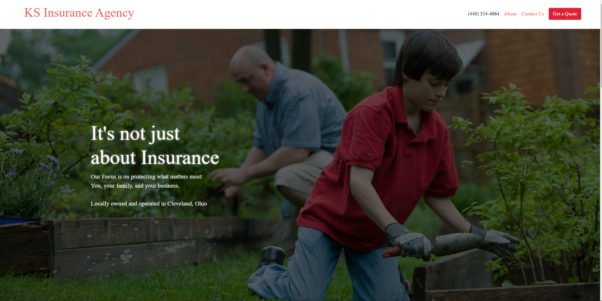

#Stewart Insurance Agency

Sales representatives can login and view leads that are stored in a database. All form submissions are stored in a database and emailed to the agency owner. Admins can assign leads to agents, mark whether or not they have been contacted yet and delete ones that no longer wish to be contacted

**Link to project:** http://ks-insurance.vercel.app

## How It's Made:

**Tech used:** React, Express, MongoDB, SASS, MUI

Built the server first using express and mongoose for a mongoDB database. I then built the front end using React and MUI Components to speed things along while keeping a clean look.

## Lessons Learned:

I learned about advanced css animation to get a smooth, scrolling hero image. I also learned the importance of really thinking and writing out exactly what you expect from an application. This not only speeds up the proccess but makes sure you get what you want in the end.
